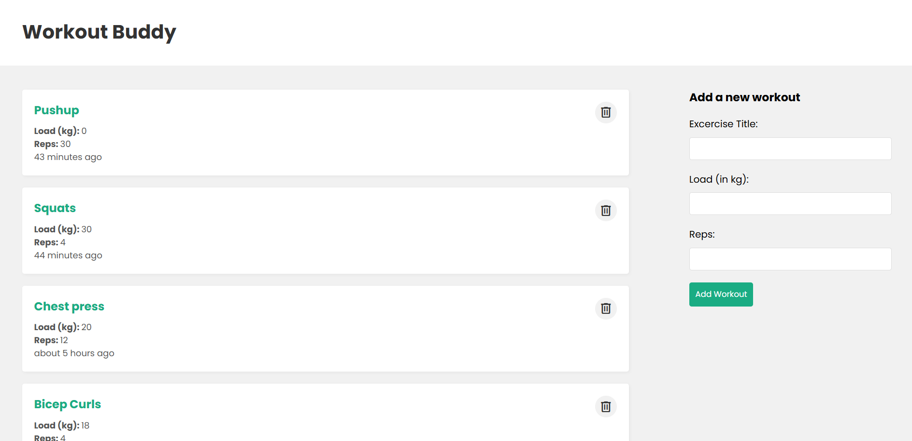

# 🏋️‍♂️ Workout Buddy  
**A full-stack MERN application to track your workouts**  

## 📌 Overview  
Workout Buddy is a **MERN stack** application that allows users to **log, update, delete, and track workouts** efficiently. It provides an intuitive UI to manage workout details like **exercise name, reps, and load** to help users stay consistent with their fitness goals.  

## 🚀 Features  
✅ **Create** a new workout (Name, Reps, Load)  
✅ **Read** and display a list of all workouts  
✅ **Update** existing workout details  
✅ **Delete** workouts when no longer needed  
✅ **Responsive UI** with a clean design  
✅ **Express.js backend with MongoDB** for data storage  

## 🛠️ Tech Stack  
- **Frontend:** React.js, Context API  
- **Backend:** Node.js, Express.js  
- **Database:** MongoDB + Mongoose  
- **Other:** Fetch API, React Hooks, CSS  

## 📷 Screenshot  
  

## 📂 Folder Structure  
```
/workout-buddy
│── /frontend        # React app (client side)
│── /backend         # Express.js + MongoDB API
│── /models          # Mongoose models
│── /routes          # API routes
│── /controllers     # Backend logic
│── /config          # Database and environment config
│── package.json     # Dependencies and scripts
│── README.md        # Documentation
```

## 🏗️ Setup Instructions  
### 1️⃣ Clone the Repository  
```bash
git clone https://github.com/yourusername/workout-buddy.git
cd workout-buddy
```
### 2️⃣ Install Dependencies  
```bash
# Install backend dependencies
cd backend
npm install

# Install frontend dependencies
cd ../frontend
npm install
```
### 3️⃣ Set Up Environment Variables  
Create a **.env** file in the **backend** folder and add:  
```env
MONGO_URI=your_mongodb_connection_string
PORT=4000
```
### 4️⃣ Start the App  
Run the backend:  
```bash
cd backend
npm start
```
Run the frontend:  
```bash
cd frontend
npm start
```
Your app should be running at **http://localhost:3000** 🚀  

## 🔗 API Endpoints  
| Method | Endpoint      | Description              |
|--------|-------------|--------------------------|
| GET    | `/api/workouts` | Fetch all workouts    |
| POST   | `/api/workouts` | Add a new workout     |
| DELETE | `/api/workouts/:id` | Delete a workout  |
| PATCH  | `/api/workouts/:id` | Update a workout  |

## 📜 License  
This project is **open-source** and free to use.  

---

